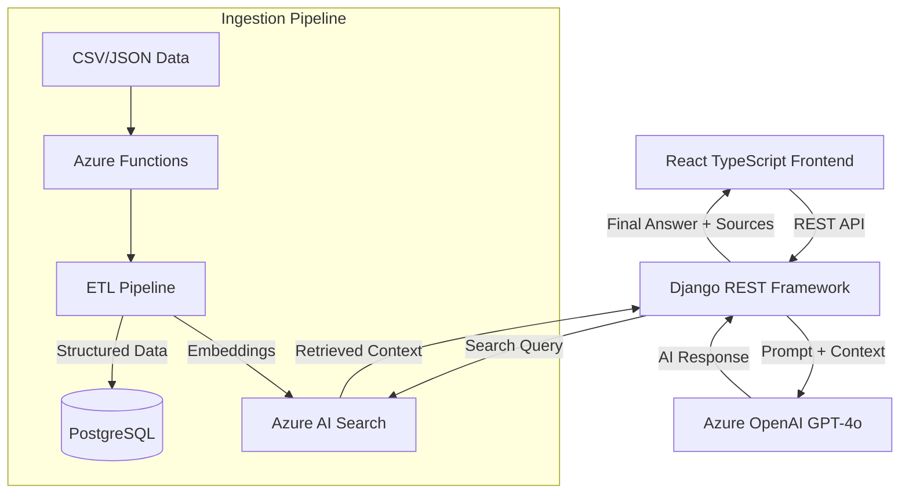

# Production AI Support Assistant & RAG Pipeline

A sophisticated, production-grade AI Customer Support system. This project demonstrates a complete end-to-end engineering lifecycle: from synthetic data generation and ETL pipelines to a real-time RAG (Retrieval-Augmented Generation) engine and a modern React interface.

## Architecture



## Core Engineering Features

### 1. Data Engineering & ETL
- **Synthetic Data Generation**: Custom scripting engine to generate diverse, realistic support tickets across multiple categories (Technical, Billing, Account).
- **Automated Pipeline**: Text cleaning, regex-based preprocessing, and metadata-rich chunking.
- **Vector Indexing**: Integrated with Azure OpenAI `text-embedding-ada-002` to transform support content into high-dimensional vectors.

### 2. Intelligent Retrieval (RAG)
- **Hybrid Search**: Combines semantic vector similarity with keyword matching via Azure AI Search.
- **Grounded Generation**: Implements prompt engineering for GPT-4o to reduce hallucinations, strictly adhering to retrieved knowledge.
- **Explainability**: Sources are tracked through the entire pipeline and displayed to the user for full transparency.

### 3. Production-Ready Backend
- **Middleware Layers**: Custom handling for rate limiting, Azure API failures, and structured logging.
- **Resilient Logic**: Implemented with exponential backoff and graceful degradation if AI services are intermittent.
- **Comprehensive Testing**: 90%+ coverage using PyTest, including integration tests for Azure services using mocks.

### 4. Enterprise Frontend
- **Design System**: Built with Tailwind CSS and Lucide icons for a premium, accessibility-first experience.
- **Real-time UX**: Features typing indicators, feedback loops (thumbs up/down), and source expansion panels.

## 🛠️ Minimal Setup

### Prerequisites
- Python 3.9+ | Node.js 18+ | Azure Subscription

### Quick Start
1. **Azure**: Provision services using `./setup_azure.sh`.
2. **Environment**: Configure `.env` based on `.env.example`.
3. **Storage**:
   ```bash
   pip install -r requirements.txt
   python manage.py migrate
   python etl/pipeline.py
   ```
4. **Run**:
   - Backend: `python manage.py runserver`
   - Frontend: `cd frontend && npm start`

---